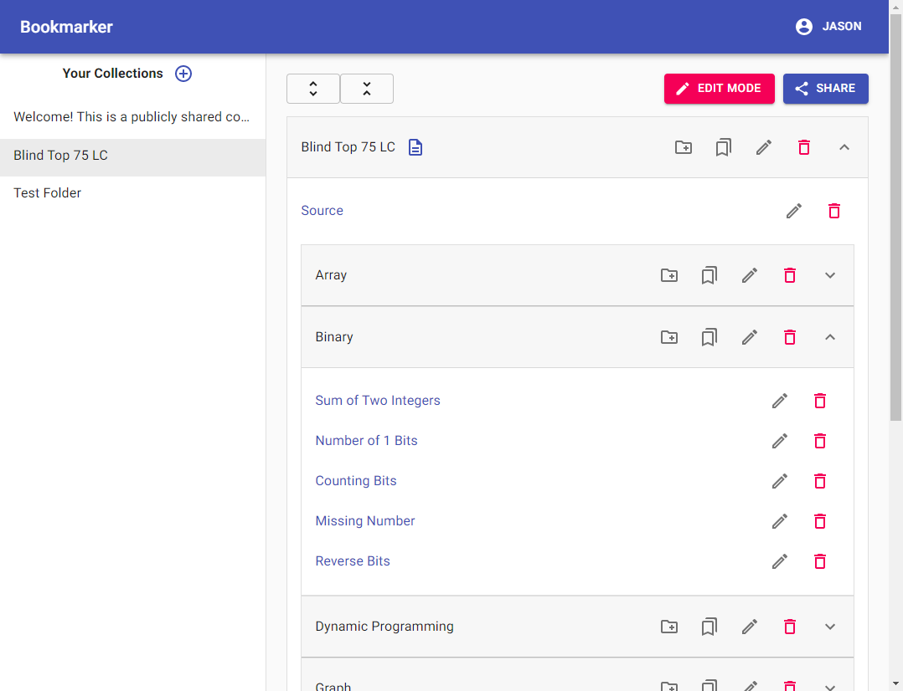

# Bookmarker

A web app for storing and sharing your bookmarks.

Live demo: https://www.bookmarker.jasondip.com/

Note: The live demo is currently being hosted on a free plan so it could take a few seconds for the initial load if the container was shut down due to inactivity.

# Features

-   Save bookmarks.
-   Organize your collection using folders and notes.
-   Share them using the share link.

# Example Collections

[Welcome](https://www.bookmarker.jasondip.com/share/5ee042cdabff530017a58844)

[Blind Top 75 LC](https://www.bookmarker.jasondip.com/share/5ee08f0058149d00174ef1dc)

# Preview

# Design Docs

More info can be found here:

https://docs.google.com/document/d/1w2pzcEHXukG-DjTF1ARePjA_dkkS2deEWzrG1gHSDbU/edit?usp=sharing
